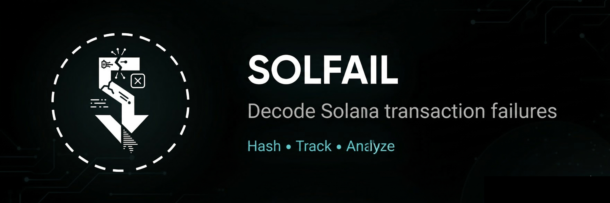

# SOLFAIL

[](https://www.npmjs.com/package/solfail)
[](https://www.npmjs.com/package/solfail)
[](./LICENSE)

[Demo Video](https://x.com/adxtyahq/status/2006973981493178435?s=20) | [Token CA](https://bags.fm/8gvrtcQWZ3FgDgxTQrioMSUDrYQUj6BVS5ThYTN6BAGS) | [npm](https://www.npmjs.com/package/solfail)

Decode Solana transaction failures into clear explanations and actionable fixes.

Solfail is a minimal, infra-grade backend for decoding Solana transaction failures with `simulateTransaction` RPC. It turns raw runtime errors into stable categories, plain-English explanations, and practical next steps for wallets, dApps, monitoring systems, and CI pipelines.

## Problem -> Solution

Solana failures are often technically correct but hard to use in product workflows.

Raw RPC responses like:

```json
{"InstructionError":[0,["Custom",6001]]}
```

do not tell a wallet what to show a user, do not tell a developer what broke, and do not tell infrastructure what to alert on.

Solfail converts those failures into readable diagnostics with:

- Stable error categories
- Plain-English explanations
- Actionable fix suggestions
- Confidence labels for downstream automation

## Quick Example

**Input**

```json
{"InstructionError":[0,["Custom",6001]]}
```

**Output**

```json
{
  "status": "FAILURE_DETECTED",
  "failureCategory": "anchor_constraint_owner",
  "confidence": "high",
  "explanation": "Anchor constraint violation: account owner does not match expected program.",
  "likelyFix": "Verify the account is owned by the correct program or initialize it properly."
}
```

## CLI Demo

```bash
npx solfail decode tx.json --devnet
```

Sample output:

```json
{
  "status": "FAILURE_DETECTED",
  "failureCategory": "missing_signer",
  "confidence": "high",
  "explanation": "A required signer account was not included when submitting the transaction.",
  "likelyFix": "Ensure the missing account signs the transaction before sending.",
  "rawError": "{\"InstructionError\":[0,[\"MissingRequiredSignature\",{}]]}",
  "matchedBy": "errorMessage",
  "mappingSource": "core"
}
```

## Demo Video

Watch the product demo on X:

[Solfail demo video](https://x.com/adxtyahq/status/2006973981493178435?s=20)

## How It Works

```text
Failed Transaction
      ↓
simulateTransaction RPC
      ↓
Solfail Parser
      ↓
Error Mapping Engine
      ↓
Human Explanation + Fix
```

## Why Solfail

- Improves developer productivity by translating cryptic runtime failures into understandable root causes
- Designed for infra-grade decoding with stable categories that are safe to depend on programmatically
- Available as a CLI, HTTP API, and TypeScript library
- Supports multiple Solana networks for local testing, staging, and production workflows

## Use Cases

- Wallet UX improvements
- dApp debugging
- CI/CD transaction validation
- Blockchain monitoring

## Installation

```bash
npm install solfail
```

Or install globally for CLI usage:

```bash
npm install -g solfail
```

### Setup

```bash
npm install
npm run build
npm start
```

Or for development:

```bash
npm run dev
```

## Quick Start

### Option 1: Use as a Library (Recommended for Projects)

```typescript
// Import the decoder function and types
import { decodeTransactionFailure } from 'solfail';
import type { DecodeRequest, DecodeResponse } from 'solfail';

// In your code
const request: DecodeRequest = {
  transactionBase64: failedTxBase64,
  network: 'devnet',
  strongMode: true
};

const result: DecodeResponse = await decodeTransactionFailure(request);

if (result.status === 'FAILURE_DETECTED') {
  console.log(`Error: ${result.failureCategory}`);
  console.log(`Fix: ${result.likelyFix}`);

  // Use stable category IDs in your logic
  if (result.failureCategory === 'missing_signer') {
    // Handle missing signer
  }
}
```

### Option 2: CLI Tool (Developer Workflow)

```bash
# Using signature (fetches from RPC)
echo '{"signature":"2Fnq3DTWf7wQcYCMCbV7L5z9Nxxrvh8kFgTfohmB3z59uyRV4HdmhvNq7AqrWNLhYpvk2kTqJ7dFwPXgkrvk2PUU","network":"devnet"}' | solfail decode --devnet

# Using transaction file
solfail decode tx.json --devnet

# Or with npx (no install needed)
npx solfail decode tx.json --devnet --strong

# Pipe to jq for filtering
solfail decode tx.json | jq '.failureCategory'
```

### Option 3: HTTP API (Microservice)

```bash
# Start the server
npm start

# Or run as a service
node dist/index.js
```

Then call from any language:

```bash
# Using transaction signature (fetches from RPC automatically)
curl -X POST http://localhost:3000/decode \
  -H "Content-Type: application/json" \
  -d '{"signature": "2Fnq3DTWf7wQcYCMCbV7L5z9Nxxrvh8kFgTfohmB3z59uyRV4HdmhvNq7AqrWNLhYpvk2kTqJ7dFwPXgkrvk2PUU", "network": "devnet"}'

# Or using base64 transaction
curl -X POST http://localhost:3000/decode \
  -H "Content-Type: application/json" \
  -d '{"transactionBase64": "YOUR_FAILED_TX_BASE64", "network": "devnet"}'
```

**What you get**: Instead of cryptic error codes like `{"InstructionError": [0, ["Custom", 6001]]}`, you get:

- Clear error category (`anchor_constraint_owner`)
- Plain English explanation
- Actionable fix suggestion
- Confidence level

## Library Usage

### Installation

```bash
# As a dependency in your project
npm install solfail

# Or globally for CLI usage
npm install -g solfail
```

### 1. Use as a TypeScript/JavaScript Library

```typescript
// Import the decoder function and types
import { decodeTransactionFailure } from 'solfail';
import type { DecodeRequest, DecodeResponse } from 'solfail';

async function handleFailedTransaction(txBase64: string) {
  const request: DecodeRequest = {
    transactionBase64: txBase64,
    network: 'devnet',
    strongMode: true
  };

  const result: DecodeResponse = await decodeTransactionFailure(request);

  if (result.status === 'FAILURE_DETECTED') {
    // Use stable category IDs for conditional logic
    switch (result.failureCategory) {
      case 'missing_signer':
        return showSignerPrompt(result.likelyFix);
      case 'account_not_rent_exempt':
        return showFundingDialog(result.explanation);
      case 'compute_budget_exceeded':
        return suggestOptimization(result.likelyFix);
      default:
        return showGenericError(result.explanation);
    }
  }

  return { success: true };
}
```

### 2. In a Wallet Application

```typescript
import { decodeTransactionFailure } from 'solfail';
import { Connection } from '@solana/web3.js';

async function onTransactionError(signature: string, connection: Connection) {
  // Decode failure directly from signature (fetches transaction automatically)
  const decoded = await decodeTransactionFailure({
    signature: signature,
    network: 'mainnet-beta'
  });

  // Show user-friendly error
  if (decoded.status === 'FAILURE_DETECTED') {
    showErrorToast({
      title: decoded.failureCategory.replace(/_/g, ' '),
      message: decoded.explanation,
      action: decoded.likelyFix
    });
  }
}
```

### 3. In a dApp (Frontend)

```typescript
// React/Next.js example
async function handleTransactionError(txBase64: string) {
  const response = await fetch('http://your-decoder-service:3000/decode', {
    method: 'POST',
    headers: { 'Content-Type': 'application/json' },
    body: JSON.stringify({
      transactionBase64: txBase64,
      network: 'devnet'
    })
  });

  const result = await response.json();

  if (result.status === 'FAILURE_DETECTED') {
    // Update UI based on error category
    setError({
      type: result.failureCategory,
      message: result.explanation,
      fix: result.likelyFix,
      confidence: result.confidence
    });
  }
}
```

### Wallet Integration

```javascript
async function handleTransactionError(failedTx, network = 'mainnet-beta') {
  const response = await fetch('http://localhost:3000/decode', {
    method: 'POST',
    headers: { 'Content-Type': 'application/json' },
    body: JSON.stringify({
      transactionBase64: failedTx,
      network: network // 'mainnet-beta', 'testnet', or 'devnet'
    })
  });

  const decoded = await response.json();

  if (decoded.status === 'SIMULATION_OK') {
    return; // No error to handle
  }

  if (decoded.failureCategory === 'missing_signer') {
    // Prompt user to sign with missing account
    return promptSigner(decoded.likelyFix);
  }

  if (decoded.failureCategory === 'account_not_rent_exempt') {
    // Show funding UI
    return showFundingDialog(decoded.explanation);
  }

  // Display user-friendly error
  showError(decoded.explanation, decoded.likelyFix);
}
```

### Example 5: Node.js Backend Service

```typescript
// Your backend service
import { decodeTransactionFailure } from 'solfail';
import express from 'express';

const app = express();

app.post('/api/transaction/analyze', async (req, res) => {
  const { transactionBase64, network } = req.body;

  try {
    const result = await decodeTransactionFailure({
      transactionBase64,
      network: network || 'mainnet-beta'
    });

    res.json(result);
  } catch (error) {
    res.status(500).json({ error: error.message });
  }
});
```

## CLI Usage

The CLI tool is a thin wrapper around the decoder logic with no duplicated mapping logic.

```bash
# Help
npm run cli -- --help

# From file
npm run cli -- -f transaction.json

# From stdin (pipe)
cat tx.json | npm run cli -- --stdin

# Auto-detect stdin when not TTY
echo '{"transactionBase64":"..."}' | npm run cli --

# Network selection (devnet)
npm run cli -- -f tx.json -n devnet

# Network selection (testnet)
npm run cli -- -f tx.json -n testnet

# Custom RPC endpoint for specific network
DEVNET_RPC_URL=https://custom-devnet-rpc.com npm run cli -- -f tx.json -n devnet

# Custom timeout
RPC_TIMEOUT_MS=60000 npm run cli -- -f tx.json
```

**Input Format** (JSON file or stdin):

```json
{
  "transactionBase64": "base64EncodedTransaction",
  "network": "devnet"
}
```

or

```json
{
  "instructions": [
    {
      "programId": "11111111111111111111111111111111",
      "accounts": ["Account1", "Account2"],
      "data": "base64Data"
    }
  ],
  "network": "testnet"
}
```

**Network field is optional** and defaults to `mainnet-beta` if omitted.

**Output**: JSON formatted response suitable for piping into `jq`.

```bash
npm run cli -- -f tx.json | jq '.failureCategory'
```

### 4. CLI in Development Workflow

```bash
# After global install: solfail
solfail decode failed-tx.json --devnet

# Or with npx (no install needed)
npx solfail decode tx.json --devnet --strong

# Pipe to jq for filtering
solfail decode tx.json | jq '.failureCategory'

# Batch processing
for tx in *.json; do
  echo "Processing $tx:"
  solfail decode "$tx" --devnet | jq '.failureCategory'
done

# Integration with scripts
CATEGORY=$(solfail decode tx.json | jq -r '.failureCategory')
if [ "$CATEGORY" = "missing_signer" ]; then
  echo "Need to add signer"
fi
```

### Error Monitoring With CLI

```bash
# Decode and alert on specific categories
solfail decode failed-tx.json | jq -r '.failureCategory' | \
  grep -q "compute_budget_exceeded" && \
  echo "ALERT: Transaction optimization needed"
```

## HTTP API

### 5. As a Standalone HTTP Service

```bash
# Start the decoder service
npm start

# Or run in production
PORT=3000 MAINNET_RPC_URL=https://your-rpc.com node dist/index.js
```

Then call from any language:

```bash
# From command line
curl -X POST http://localhost:3000/decode \
  -H "Content-Type: application/json" \
  -d '{"transactionBase64": "...", "network": "devnet"}'

# From Python
import requests
response = requests.post('http://localhost:3000/decode', json={
    'transactionBase64': tx_base64,
    'network': 'devnet'
})
result = response.json()
print(result['failureCategory'])

# From Go
resp, _ := http.Post("http://localhost:3000/decode",
    "application/json",
    bytes.NewBuffer(jsonData))
```

### Endpoint: `POST /decode`

#### Option 1: Transaction Base64

```bash
# Using signature (fetches from RPC automatically)
curl -X POST http://localhost:3000/decode \
  -H "Content-Type: application/json" \
  -d '{
    "signature": "2Fnq3DTWf7wQcYCMCbV7L5z9Nxxrvh8kFgTfohmB3z59uyRV4HdmhvNq7AqrWNLhYpvk2kTqJ7dFwPXgkrvk2PUU",
    "network": "devnet"
  }'

# Using base64 transaction (mainnet - default)
curl -X POST http://localhost:3000/decode \
  -H "Content-Type: application/json" \
  -d '{
    "transactionBase64": "AQAAAAAAAAAAAAAAAAAAAAAAAAAAAAAAAAAAAAAAAAAAAAAAAAAAAAAAAAAAAAAAAAAAAAAAAAAAAAAAAAAAAAABAAEDArj..."
  }'

# Using base64 transaction (devnet)
curl -X POST http://localhost:3000/decode \
  -H "Content-Type: application/json" \
  -d '{
    "transactionBase64": "...",
    "network": "devnet"
  }'
```

#### Option 2: Raw Instructions

```bash
# Testnet
curl -X POST http://localhost:3000/decode \
  -H "Content-Type: application/json" \
  -d '{
    "instructions": [
      {
        "programId": "11111111111111111111111111111111",
        "accounts": ["AccountPubkey1", "AccountPubkey2"],
        "data": "base64EncodedInstructionData"
      }
    ],
    "network": "testnet"
  }'
```

### Response Format

**Failure Detected:**

```json
{
  "status": "FAILURE_DETECTED",
  "failureCategory": "missing_signer",
  "confidence": "likely",
  "explanation": "A required signer account was not included when submitting the transaction.",
  "likelyFix": "Ensure the missing account signs the transaction before sending.",
  "rawError": "{\"code\":2,\"message\":\"Instruction requires a signer\"}",
  "matchedBy": "errorMessage",
  "mappingSource": "core"
}
```

**Simulation Succeeded:**

```json
{
  "status": "SIMULATION_OK",
  "note": "No failure detected during simulation."
}
```

**With Strong Mode** (`STRONG_MODE=true` or `"strongMode": true` in request):

```json
{
  "failureCategory": "missing_signer",
  "confidence": "likely",
  "confidenceScore": 40,
  "explanation": "A required signer account was not included when submitting the transaction.",
  "likelyFix": "Ensure the missing account signs the transaction before sending.",
  "rawError": "{\"code\":2,\"message\":\"Instruction requires a signer\"}",
  "matchedBy": "errorMessage"
}
```

### Response Fields

- `status`: Response status (`SIMULATION_OK` or `FAILURE_DETECTED`)
- `failureCategory`: When status is `FAILURE_DETECTED`, the identified error category. Category IDs are stable and safe to depend on.
- `confidence`: When status is `FAILURE_DETECTED`, classification confidence level (`high`, `likely`, `uncertain`)
- `explanation`: When status is `FAILURE_DETECTED`, plain-English explanation of the failure
- `likelyFix`: When status is `FAILURE_DETECTED`, practical suggestion to resolve the issue
- `rawError`: When status is `FAILURE_DETECTED`, original RPC error JSON for transparency
- `matchedBy`: When status is `FAILURE_DETECTED`, internal debugging field showing which matcher type was used
- `confidenceScore`: Strong mode only, internal confidence score from `0-100`
- `note`: Optional warning when failure may depend on runtime state, or success message when simulation passes
- `mappingSource`: When status is `FAILURE_DETECTED`, source of the error mapping (`core` or `community`)

### Stable Category IDs

**Category IDs are stable and safe to depend on** for:

- Wallet UX logic
- CI/CD rules
- Alert routing

All category IDs use lowercase with underscores such as `compute_budget_exceeded` and `missing_signer`.

### Confidence Scoring

Confidence is computed internally based on matcher type:

- **logPattern match**: Score 70 -> `high` confidence
- **errorMessage match**: Score 40 -> `likely` confidence
- **errorCode match**: Score 20 -> `uncertain` confidence

The score is mapped to labels:

- `high`: Score >= 50
- `likely`: Score >= 30
- `uncertain`: Score < 30

**Strong Mode**: Enable via `STRONG_MODE=true` environment variable or `"strongMode": true` in request to expose `confidenceScore`.

### Simulation Limitations

The decoder automatically detects cases where simulation may not accurately reflect real execution:

- **Slot-dependent logic**: Transactions that depend on specific slot numbers
- **Time-dependent logic**: Transactions that depend on `Clock` sysvar or timestamps
- **Blockhash expiration**: Transactions with expired recent blockhashes
- **Already-executed**: Transactions that were already processed

When detected, a `note` field is included:

```json
{
  "failureCategory": "account_not_rent_exempt",
  "confidence": "high",
  "explanation": "Account does not have sufficient lamports to be rent-exempt.",
  "likelyFix": "Fund the account with enough lamports to meet rent-exempt minimum.",
  "rawError": "...",
  "matchedBy": "errorMessage",
  "note": "This failure may depend on runtime state and may not reproduce in simulation."
}
```

**Detection covers:**

- Slot-dependent logic
- Time-dependent logic
- Blockhash expiration
- Already-executed transactions

This transparency increases trust by clearly indicating when simulation results may differ from actual execution.

### Example 6: Python Integration

```python
# Using the HTTP API from Python
import requests

def decode_transaction(tx_base64, network='devnet'):
    response = requests.post(
        'http://localhost:3000/decode',
        json={
            'transactionBase64': tx_base64,
            'network': network
        }
    )
    return response.json()

# Usage
result = decode_transaction(tx_base64, 'devnet')
if result['status'] == 'FAILURE_DETECTED':
    print(f"Error: {result['failureCategory']}")
    print(f"Fix: {result['likelyFix']}")
```

## Configuration

- `PORT`: Server port, defaults to `3000`
- `MAX_REQUEST_SIZE`: Maximum request body size, defaults to `"1mb"`
- `RPC_TIMEOUT_MS`: RPC request timeout in milliseconds, defaults to `30000`
- `MAINNET_RPC_URL`: Override mainnet RPC endpoint
- `TESTNET_RPC_URL`: Override testnet RPC endpoint
- `DEVNET_RPC_URL`: Override devnet RPC endpoint
- `STRONG_MODE`: Enable strong mode to expose `confidenceScore`, defaults to `false`

## Multi-Network Support

Decoding on devnet and testnet is fully supported and recommended during development.

**Supported Networks:**

- `mainnet-beta` (default)
- `testnet`
- `devnet`

**Network Selection:**

- HTTP API: Include `"network": "devnet"` in request body
- CLI: Use `-n devnet` flag or include `"network"` in JSON input
- Environment variables allow per-network RPC endpoint overrides

## Community Error Mappings

The decoder supports community-contributed error mappings to expand coverage. All mappings are manually reviewed before inclusion.

**How it works:**

- `errorMappings.ts` is the source of truth
- Contributors submit mappings via GitHub Issues or Pull Requests
- Manual review only, no auto-merge
- Approved mappings are marked with `source: "community"`
- Responses expose the source through the `mappingSource` field

**To contribute:**

1. Provide a log sample, error type, explanation, and fix.
2. Submit via GitHub Issue with label `error-mapping` or open a Pull Request.
3. Include real transaction logs and error responses.
4. Wait for manual review and approval.

See [CONTRIBUTING.md](./CONTRIBUTING.md) for detailed submission guidelines.

**Transparency = Trust**: All mappings show their source (`core` or `community`) in the response.

## Supported Error Categories

**Category IDs are stable and safe to depend on** for wallet UX, CI rules, and alert routing.

- `compute_budget_exceeded`
- `missing_signer`
- `account_not_writable`
- `account_not_rent_exempt`
- `incorrect_pda`
- `program_panic`
- `anchor_constraint_owner`
- `anchor_constraint_seeds`
- `anchor_constraint_mut`
- `unknown`

## Error Confidence Levels

- `high`: Error pattern matches with high certainty
- `likely`: Error pattern matches but may have edge cases
- `uncertain`: No matching pattern found, raw error provided for manual inspection

## Examples

### Example 1: Real Devnet Transaction Decoded

**This is real chain data, not a synthetic fixture.**

**Real Transaction**

- **Signature**: `2Fnq3DTWf7wQcYCMCbV7L5z9Nxxrvh8kFgTfohmB3z59uyRV4HdmhvNq7AqrWNLhYpvk2kTqJ7dFwPXgkrvk2PUU`
- **Network**: Devnet
- **Explorer**: [View on Solana Explorer](https://explorer.solana.com/tx/2Fnq3DTWf7wQcYCMCbV7L5z9Nxxrvh8kFgTfohmB3z59uyRV4HdmhvNq7AqrWNLhYpvk2kTqJ7dFwPXgkrvk2PUU?cluster=devnet)

**Before**: Raw RPC error is cryptic

```json
{
  "InstructionError": [0, {"Custom": 6204}]
}
```

**After**: Clear explanation with actionable fix

```bash
curl -X POST http://localhost:3000/decode \
  -H "Content-Type: application/json" \
  -d '{
    "transactionBase64": "AT7Ffhx5JGAUOp8HKs4nHAbZqAyHYE2nAF9j5Hi8djgqLwo+lzHIIJxKwC0DLCPGMb6EgDP8FIHlr3E6Z9S1/gkBAAgNC3AWSePHsFNdCL0v8pGHdEDmaq2r/fN92mA7ZuMS4gpU6FI9WzoLJyNtibMKva3By3X/68c8rDG119IChcMzk2vKinixtq0v0djypOXsZT2KCnt2PNcFYYNjnbIrFx3Xd6fjMDSS9IwBepLJyRP/oBcYLerJ5rwwgsN9YfcmmO7oO0CVyL2tyMV/PjCsjXIMG5pbe7D0CSxy3gDbcnh0jAAAAAAAAAAAAAAAAAAAAAAAAAAAAAAAAAAAAAAAAAAABN+teWL/sd2SXQqftebQDOYZW6i7OpH9B++YYMXpe7gFgXD/AeaMAXoF7Jol8HeB4aGuT5hXq7IGXUnmSQSXngan1RcYe9FmNdrUBFX9wsDBJMaPIVZ1pdu6y18IAAAAmIPIii/XvhfRiikWQLvN9NB0ICEkkPTvMHOJmXk9AxGhXNLxg+l6LWjByJzBy59n9aCSPFu50hceTih7PplBZdCX2Cp03WYcqUoQFOAOxKESRdDKPQlsIOQaSshprBQH4wo6Kq2KROQXYcxcMmyUvjPOm6momuVUKFc/y+vqEN60RGaFGM1EZyCiGAaNcJOOmnD3Sevd9plVu8HS4UR6vwQLCgAKBwMCAQQJBQhbC+Aq7ACaSqNNOdWmA5Z5BtNyFjb2mXVY4wo6Kq2KROQXYcxcMmyUvjPOm6momuVUKFc/y+vqEN4BAunpSF/GactpZpiYpKUYHPbMf1HS5U6QMl2PSZNnNRD/AAwGCwkHAgMICTkWkAA9NdpuAQYBAAwGAAAJ02jpAAAAAAQGAQAMBgAAM55p6QAAAAAF",
    "network": "devnet",
    "strongMode": true
  }'
```

**Response:**

```json
{
  "status": "FAILURE_DETECTED",
  "failureCategory": "program_panic",
  "confidence": "high",
  "explanation": "Program execution panicked, typically due to assertion failure or invalid state.",
  "likelyFix": "Review program logic and ensure all preconditions are met before execution.",
  "rawError": "{\"InstructionError\":[0,{\"Custom\":6204}]}",
  "matchedBy": "logPattern",
  "mappingSource": "core",
  "confidenceScore": 70
}
```

**What This Shows**

- Real blockchain data
- Accurate detection
- Actionable output
- Production-ready behavior

**Use Case**: Validates the decoder against actual devnet failures.

### Example 2: Missing Signer

**Before**: Raw RPC error is cryptic

```json
{
  "InstructionError": [0, ["MissingRequiredSignature", {}]]
}
```

**After**: Clear explanation with actionable fix

```bash
curl -X POST http://localhost:3000/decode \
  -H "Content-Type: application/json" \
  -d '{
    "transactionBase64": "YOUR_FAILED_TX_BASE64"
  }'
```

**Response:**

```json
{
  "status": "FAILURE_DETECTED",
  "failureCategory": "missing_signer",
  "confidence": "high",
  "explanation": "A required signer account was not included when submitting the transaction.",
  "likelyFix": "Ensure the missing account signs the transaction before sending.",
  "rawError": "{\"InstructionError\":[0,[\"MissingRequiredSignature\",{}]]}",
  "matchedBy": "errorMessage",
  "mappingSource": "core"
}
```

**Use Case**: Wallet integration where the UI needs to identify the missing signer path immediately.

### Example 3: Anchor Constraint Owner Violation (Devnet)

**Before**: Custom error code requires looking up Anchor error codes

```json
{
  "InstructionError": [0, ["Custom", 6001]]
}
```

**After**: Immediate understanding of the constraint violation

```bash
curl -X POST http://localhost:3000/decode \
  -H "Content-Type: application/json" \
  -d '{
    "instructions": [
      {
        "programId": "YourProgramId",
        "accounts": ["Account1", "Account2"],
        "data": "base64InstructionData"
      }
    ],
    "network": "devnet"
  }'
```

**Response:**

```json
{
  "status": "FAILURE_DETECTED",
  "failureCategory": "anchor_constraint_owner",
  "confidence": "high",
  "explanation": "Anchor constraint violation: account owner does not match expected program.",
  "likelyFix": "Verify the account is owned by the correct program or initialize it properly.",
  "rawError": "{\"InstructionError\":[0,[\"Custom\",6001]]}",
  "matchedBy": "logPattern",
  "mappingSource": "core"
}
```

**Use Case**: Anchor program debugging without manually decoding error `6001`.

### Example 4: Compute Budget Exceeded

**Before**: Generic error with no context

```json
{
  "InstructionError": [0, ["ComputationalBudgetExceeded", {}]]
}
```

**After**: Clear explanation with optimization guidance

```bash
curl -X POST http://localhost:3000/decode \
  -H "Content-Type: application/json" \
  -d '{
    "transactionBase64": "YOUR_TX_BASE64"
  }'
```

**Response:**

```json
{
  "status": "FAILURE_DETECTED",
  "failureCategory": "compute_budget_exceeded",
  "confidence": "high",
  "explanation": "Transaction exceeded the compute unit limit allocated for execution.",
  "likelyFix": "Reduce transaction complexity or increase compute budget limit.",
  "rawError": "{\"InstructionError\":[0,[\"ComputationalBudgetExceeded\",{}]]}",
  "matchedBy": "errorMessage",
  "mappingSource": "core"
}
```

**Use Case**: Transaction optimization and compute tuning.

### Example 5: Account Not Rent Exempt

**Before**: Unclear what "insufficient funds" means

```json
{
  "InstructionError": [0, ["InsufficientFundsForRent", {"accountIndex": 1}]]
}
```

**After**: Specific explanation about rent exemption

```bash
curl -X POST http://localhost:3000/decode \
  -H "Content-Type: application/json" \
  -d '{
    "transactionBase64": "YOUR_TX_BASE64"
  }'
```

**Response:**

```json
{
  "status": "FAILURE_DETECTED",
  "failureCategory": "account_not_rent_exempt",
  "confidence": "high",
  "explanation": "Account does not have sufficient lamports to be rent-exempt.",
  "likelyFix": "Fund the account with enough lamports to meet rent-exempt minimum.",
  "rawError": "{\"InstructionError\":[0,[\"InsufficientFundsForRent\",{\"accountIndex\":1}]]}",
  "matchedBy": "errorMessage",
  "mappingSource": "core"
}
```

**Use Case**: Account initialization and funding workflows.

### Example 6: Program Panic

**Before**: Generic custom error code

```json
{
  "InstructionError": [0, ["Custom", 1]]
}
```

**After**: Identified as program panic with context

```bash
curl -X POST http://localhost:3000/decode \
  -H "Content-Type: application/json" \
  -d '{
    "transactionBase64": "YOUR_TX_BASE64"
  }'
```

**Response:**

```json
{
  "status": "FAILURE_DETECTED",
  "failureCategory": "program_panic",
  "confidence": "high",
  "explanation": "Program execution panicked, typically due to assertion failure or invalid state.",
  "likelyFix": "Review program logic and ensure all preconditions are met before execution.",
  "rawError": "{\"InstructionError\":[0,[\"Custom\",1]]}",
  "matchedBy": "logPattern",
  "mappingSource": "core"
}
```

**Use Case**: Program debugging and triage.

### Example 7: Anchor Constraint Seeds (PDA Mismatch)

**Before**: Custom error code `6006` requires Anchor documentation lookup

```json
{
  "InstructionError": [0, ["Custom", 6006]]
}
```

**After**: Clear PDA seeds constraint violation

```bash
curl -X POST http://localhost:3000/decode \
  -H "Content-Type: application/json" \
  -d '{
    "instructions": [
      {
        "programId": "YourProgramId",
        "accounts": ["PDA1", "PDA2"],
        "data": "base64Data"
      }
    ]
  }'
```

**Response:**

```json
{
  "status": "FAILURE_DETECTED",
  "failureCategory": "anchor_constraint_seeds",
  "confidence": "high",
  "explanation": "Anchor constraint violation: PDA seeds do not match the constraint definition.",
  "likelyFix": "Ensure PDA seeds match the account constraint seeds exactly.",
  "rawError": "{\"InstructionError\":[0,[\"Custom\",6006]]}",
  "matchedBy": "logPattern",
  "mappingSource": "core"
}
```

**Use Case**: Anchor development and PDA derivation debugging.

### Example 8: Account Not Writable

**Before**: Unclear permission error

```json
{
  "InstructionError": [0, ["ReadonlyLamportChange", {}]]
}
```

**After**: Specific writable permission issue

```bash
curl -X POST http://localhost:3000/decode \
  -H "Content-Type: application/json" \
  -d '{
    "transactionBase64": "YOUR_TX_BASE64"
  }'
```

**Response:**

```json
{
  "status": "FAILURE_DETECTED",
  "failureCategory": "account_not_writable",
  "confidence": "high",
  "explanation": "An account that must be writable was marked as read-only or not provided.",
  "likelyFix": "Ensure the account is included in the transaction with writable permission.",
  "rawError": "{\"InstructionError\":[0,[\"ReadonlyLamportChange\",{}]]}",
  "matchedBy": "errorMessage",
  "mappingSource": "core"
}
```

**Use Case**: Transaction construction and account metadata debugging.

## Integration Examples

### Error Monitoring & Alerting

```typescript
// Monitor transaction failures in production
import { decodeTransactionFailure } from 'solfail';

async function logTransactionFailure(signature: string) {
  const decoded = await decodeTransactionFailure({
    transactionBase64: await getTxBase64(signature),
    network: 'mainnet-beta'
  });

  if (decoded.status === 'FAILURE_DETECTED') {
    // Send to analytics
    await analytics.track('transaction_failure', {
      category: decoded.failureCategory,
      confidence: decoded.confidence,
      network: 'mainnet-beta'
    });

    // Alert on specific categories
    if (decoded.failureCategory === 'compute_budget_exceeded') {
      await sendAlert('Transaction optimization needed');
    }
  }
}
```

### Monitoring Service Example

```typescript
// Monitor transaction failures
async function logTransactionFailure(signature: string) {
  const decoded = await decodeTransactionFailure({
    transactionBase64: await getTxBase64(signature),
    network: 'mainnet-beta'
  });

  if (decoded.status === 'FAILURE_DETECTED') {
    // Send to monitoring service
    await analytics.track('transaction_failure', {
      category: decoded.failureCategory,
      confidence: decoded.confidence,
      network: 'mainnet-beta'
    });

    // Alert on specific categories
    if (decoded.failureCategory === 'compute_budget_exceeded') {
      await sendAlert('Transaction optimization needed');
    }
  }
}
```

### CI/CD Pipeline Example

```yaml
# GitHub Actions example
- name: Decode failed transactions
  run: |
    npm install -g solfail
    for tx in failed-txs/*.json; do
      CATEGORY=$(solfail decode "$tx" --devnet | jq -r '.failureCategory')
      echo "Transaction $tx: $CATEGORY"

      # Fail build on critical errors
      if [ "$CATEGORY" = "missing_signer" ] || [ "$CATEGORY" = "account_not_rent_exempt" ]; then
        echo "::error::Critical error: $CATEGORY"
        exit 1
      fi
    done
```

### CI/CD Pipeline Variant

```yaml
# GitHub Actions example
- name: Decode transaction failures
  run: |
    npm install -g solfail
    for tx in failed-txs/*.json; do
      CATEGORY=$(solfail decode "$tx" --devnet | jq -r '.failureCategory')
      echo "Transaction $tx: $CATEGORY"

      # Fail build on critical errors
      if [ "$CATEGORY" = "missing_signer" ] || [ "$CATEGORY" = "account_not_rent_exempt" ]; then
        echo "::error::Critical error: $CATEGORY"
        exit 1
      fi
    done
```
